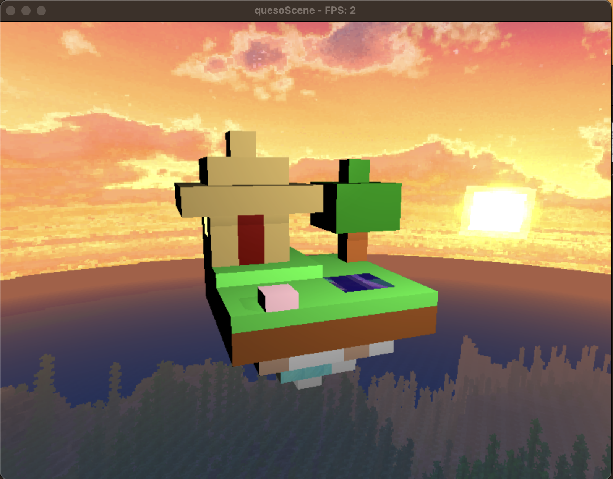
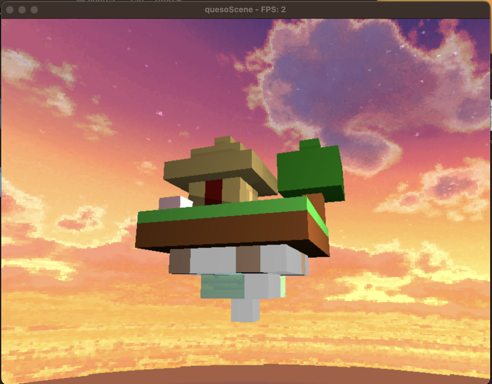
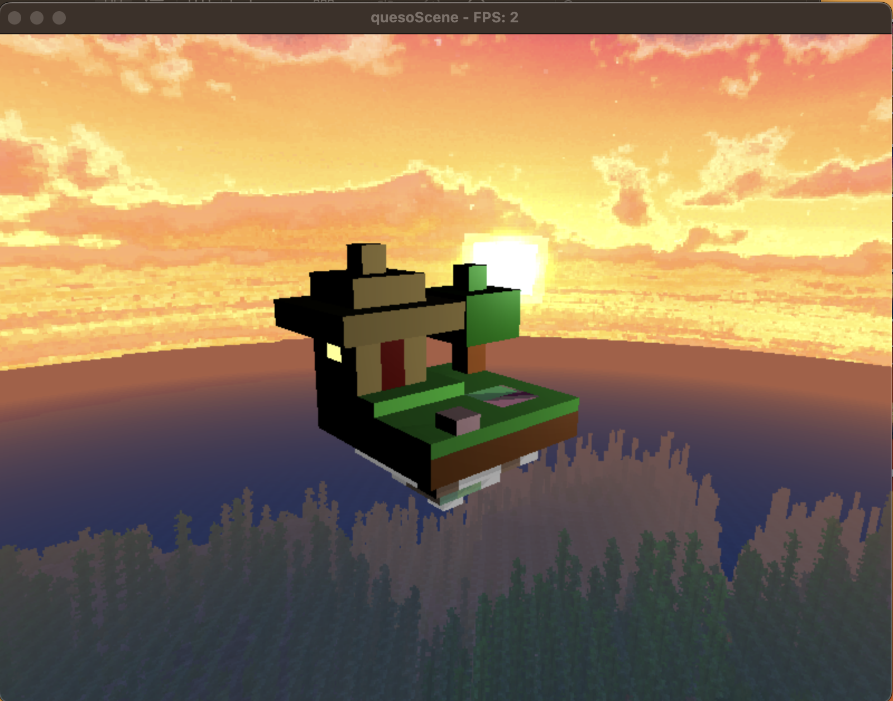
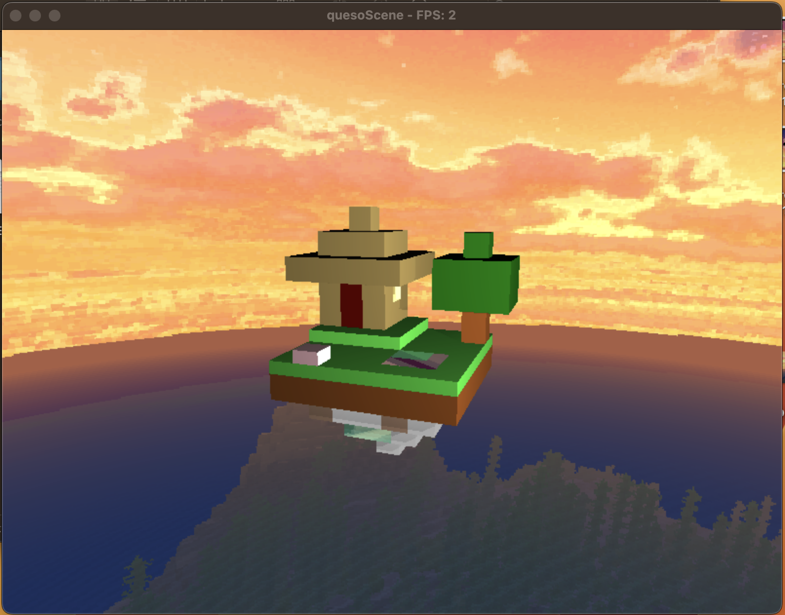
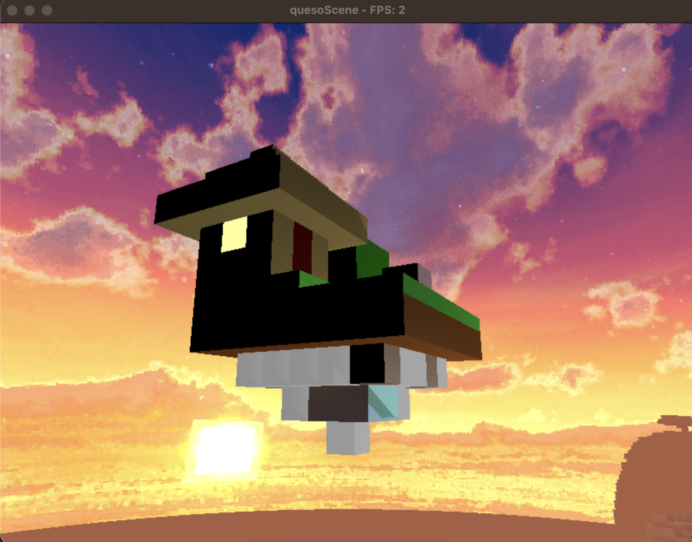
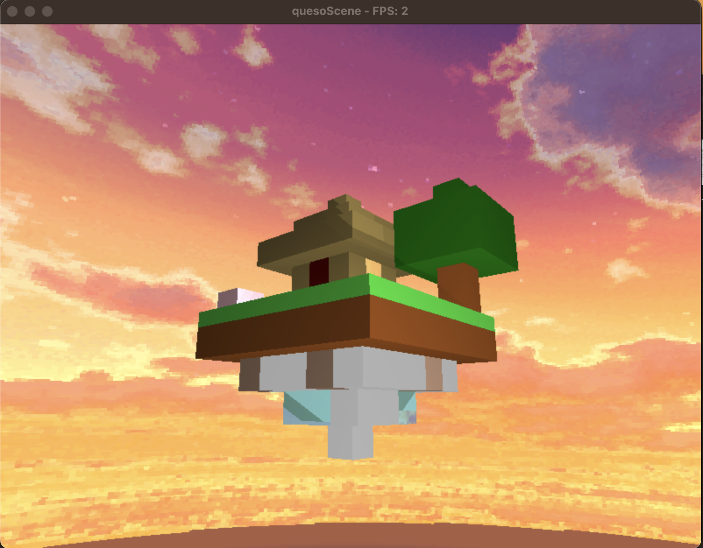

# CG-PR3
Project #3 - Computer Graphics

# Explicación
- El proyecto consiste en la renderización en tiempo real de un diorama al estilo minecraft
- Ray Tracing para renderizar el diorama
- Se crean cubos de 11 diferentes materiales que interactuan con la luz
- Se implementó un skybox que muestra un paisaje alrededor
- Los materiales tienen diferentes propiedades de reflexión, refracción, difusión, etc.

# Controles
- wasd: mover la cámara
- o: zoom out
- p: zoom in
- flechas: mover la luz

# Lenguaje
- C++

# Instrucciones para correr
- Configurar con `zsh configure.sh`
- Compilar con `zsh build.sh`
- Correr con `zsh run.sh`

# Rúbrica

## Criterios Subjetivos
- [x] (0 a 30 puntos) Por la complejidad de la escena.
  - **Razón:**  30/30 La escena es compleja y detallada, con 11 diferentes materiales y un skybox.

- [x] (0 a 20 puntos) Por la atractividad visual de la escena.
  - **Razón:** 20/20 Esta hecha con mucho amor y cariño.

## Movimiento y Rotación
- [x] (0 a 20 puntos) Por implementar rotación en el diorama y permitir que la cámara se acerque y aleje.
  - **Razón:** 20/20 Se permite rotación y zoom en la escena. Asi como movimiento de la luz.

## Materiales
- [x] (0 a 5 puntos) 5 Puntos por cada material diferente (máximo 5).
  - **Razón:**  25/25 Se implementan 11 diferentes materiales con texturas, parámetros de albedo, specular, transparencia y reflectividad.

- [x] (0 a 10 puntos) Por implementar refracción en al menos un material.
  - **Razón:** 10/10 El material de agua, vidrio y el diamante tienen propiedades de refracción.

- [x] (0 a 5 puntos) Por implementar reflexión en al menos un material.
  - **Razón:** 5/5 El material de agua, vidrio y el diamante tienen propiedades de reflexión.

## Skybox
- [x] (0 a 20 puntos) Por implementar un skybox para al menos un material.
  - **Razón:** 20/20 Se implemento el skybox al entorno para darle un paisaje alrededor.

## Total de Puntos: 130/130

## Showcase

- [Video del Juego](https://youtu.be/A060aouTdyY)
- 
- 
- 
- 
- 
- 

